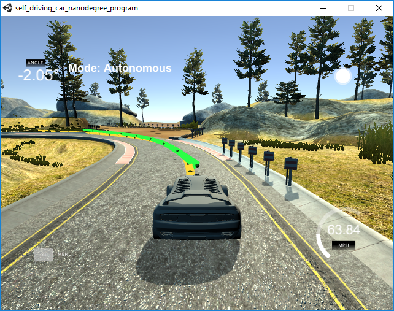
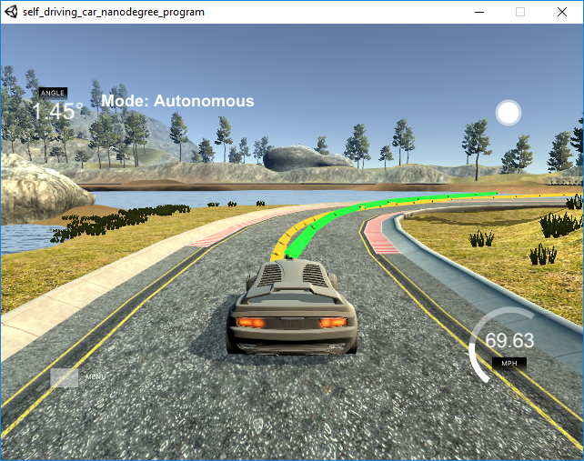
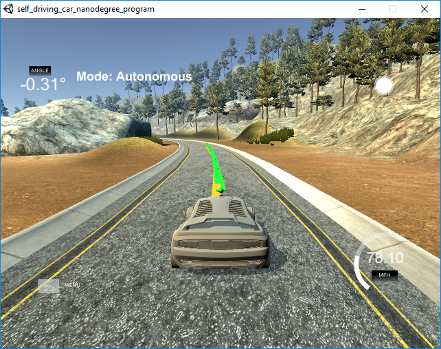

## Model Predictive Control (MPC) Project


The goal of this project is to implement Model Predictive Control to drive the car around the track.

## [Rubric](https://review.udacity.com/#!/rubrics/896/view) Points

### Here I will consider the rubric points individually and describe how I addressed each point in my implementation.  

---

### Compilation
#### Your code should compile.

I followed the instructions from the README.

```
    Make a build directory: mkdir build && cd build
    Compile: cmake .. && make
    Run it: ./mpc.
```

Everything works as expected.

```
[100%] Linking CXX executable mpc

[100%] Built target mpc

sdim@STAVROS-HP:/mnt/f/CarND-MPC-Project/build$
```

### Implementation
#### The Model

The MPC model uses equations that describe the state of the vehicle.
The two front wheels of the vehicle move together, so do the rear wheels.
So we can assume that the front wheels act as one and the rear wheels act as one. This is the model of a bicycle.

The MPC algorithm takes as inputs the current state and the constraints and the cost function and it calculates the controls. 
The solution is the set of control values that minimize the cost function while they are still within the specific constraints limits.

On this project, the cost function and the constraints are hardcoded inside the MPC class, the current state is passed as a parameter of the 'Solve' method.


Here is the code that sets up the cost function fg[0].

```
// The part of the cost based on the reference state.
		for (int t = 0; t < N; t++)
		{
			fg[0] += 1000 * CppAD::pow(vars[cte_start + t], 2);      // the cost of the cross track error
			fg[0] += 1000 * CppAD::pow(vars[epsi_start + t], 2);	 // the cost of the angle psi error
			fg[0] += CppAD::pow(vars[v_start + t] - ref_v, 2);       // the cost of the velocity error. It is very low because the reference velocity is the top limit, lower values are more safe and safety comes first.
		}

		// Minimize the use of actuators.
		for (int t = 0; t < N - 1; t++)
		{
			fg[0] += CppAD::pow(vars[delta_start + t], 2);   // minimize the use of the wheel
			fg[0] += CppAD::pow(vars[a_start + t], 2);		 // minimize the use of the throttle pedal
		}

		// Minimize the value gap between sequential actuations.
		for (int t = 0; t < N - 2; t++)
		{
			fg[0] += 100 * CppAD::pow(vars[delta_start + t + 1] - vars[delta_start + t], 2); // minimize the changes on the steering wheel direction. It makes the trip more comfortable. Fast changes may make the passengers feel sea sick.
			fg[0] += 10 * CppAD::pow(vars[a_start + t + 1] - vars[a_start + t], 2);			// minimize the changes on the throttle. It makes the trip more comfortable.
		}


```
Here is the code that sets up the constraints. The steering angle is in the range  [-25°,25°] and the acceleration is in the range [-1,1] .

```

	// Set the constraint for the steering angle to 25 degrees
	for (int i = delta_start; i < a_start; i++)
	{
		vars_lowerbound[i] = -0.436332;  // 25° converted to rad
		vars_upperbound[i] = 0.436332;
	}

	// Set the constraint for the throttle to +/-1
	for (int i = a_start; i < n_vars; i++)
	{
		vars_lowerbound[i] = -1.0;
		vars_upperbound[i] = 1.0;
	}
```

The kinematic equations are the following:

The location prediction on the X axis after time dt:

```
Xt+1 = Xt + Vt*cos(Ψt) * dt
```

The location prediction on the Y axis after time dt:

```
Yt+1 = Yt + Vt*cos(Ψt) * dt
```

The prediction of the psi angle after time dt:

```
Ψt+1 = Ψt + Vt /Lf * δt + dt
```


The prediction of the vehicle speed after time dt:

```
Vt+1 = Vt + at * dt
```
at is the acceleration of the vehicle.

The library 'ipopt' is used for solving the MPC problem

```
	// place to return solution
	CppAD::ipopt::solve_result<Dvector> solution;

	// solve the problem
	CppAD::ipopt::solve<Dvector, FG_eval>(
		options, vars, vars_lowerbound, vars_upperbound, constraints_lowerbound,
		constraints_upperbound, fg_eval, solution);

	// Check some of the solution values
	ok &= solution.status == CppAD::ipopt::solve_result<Dvector>::success;

#### Timestep Length and Elapsed Duration (N & dt)

I chosen N = 10 and dt = 0.1.

Lower N values would produce a less accurate prediction and it would be more difficult to keep the vehicle close to the desired path.
Higher N values would increase the computational cost. Since the value I used gives acceptable results, there is no need to increase it.

Lower dt values would give better estimation but the computational cost would be increased without improving the result.
Higher dt values would make the model to behave slower and it would be more difficult to keep the vehicle in path when the speed is high.

MPC estimates the path for the next N * dt = 10 * 0.1sec = 1sec. 
Decreasing this time, lets say for 0.5sec, make the motion too erratic and the passengers may feel sea sick.
Increasing this time improves the stability of the solution, the vehicle moves smoother, but in real world it is unnecessary because the traffic is unpredicted for many seconds later.

Larger values of N would increase the computational cost  
```
size_t N = 10;
double dt = 0.1;
```


#### Polynomial Fitting and MPC Preprocessing


The polynomial fitting is implementing using the code from the [Udacity - MPC Quizes](https://github.com/udacity/CarND-MPC-Quizzes/)
        
```
// Fit a polynomial.
// Adapted from
// https://github.com/JuliaMath/Polynomials.jl/blob/master/src/Polynomials.jl#L676-L716
Eigen::VectorXd polyfit(Eigen::VectorXd xvals, Eigen::VectorXd yvals,
                        int order) {
  assert(xvals.size() == yvals.size());
  assert(order >= 1 && order <= xvals.size() - 1);
  Eigen::MatrixXd A(xvals.size(), order + 1);

  for (int i = 0; i < xvals.size(); i++) {
    A(i, 0) = 1.0;
  }

  for (int j = 0; j < xvals.size(); j++) {
    for (int i = 0; i < order; i++) {
      A(j, i + 1) = A(j, i) * xvals(j);
    }
  }

  auto Q = A.householderQr();
  auto result = Q.solve(yvals);
  return result;
}
```

The data are preprocessed in three steps.

The first preprocessing step is used to convert the steering angle from the simulator coordinate system (clockwise) to our model coordination system (anti-clockwise). I used the minus sign to make the conversion.

```
  
		  // The simulator angles are counterwise while the MPC angles are anti-counterwise.
		// I use the minus sign to make the conversion
		  msgJson["steering_angle"] = -vars[0]/(deg2rad(25)*Lf);
```

The second preprocessing step is used to compensate the actuators delay.
The actuators have 100ms delay. It is described on the next rubric point.

The third preprocessing step is used to move from simulator coordinates to local coordinates. 
This step also reduces the computational cost of the MPC algorithm because the first variables on the state vector (x, y, psi) are zero on the local coordinate system.

```
	
          for (int i = 0; i < ptsx.size(); i++) {
            double shift_x = ptsx[i] - x_predicted;
            double shift_y =  ptsy[i] - y_predicted;
            local_x[i] = (shift_x * cos(-psi_predicted) - shift_y * sin(-psi_predicted));
            local_y[i] = (shift_x * sin()-psi_predicted) + shift_y * cos(-psi_predicted));
          }
```


#### Model Predictive Control with Latency

The actuators have a 100ms delay. To compensate that, I calculated the estimated state parameters after 100ms.

```
          double latency = 0.1;  // 100ms = 0.1sec
          double v_predicted = v + throttle_value * latency;
          double psi_predicted = psi + v_predicted / Lf * steer_value_mpc * latency;
          double x_predicted = px + v_predicted * cos(psi_predicted) * latency;
          double y_predicted = py + v_predicted * sin(psi_predicted) * latency;	
```


### Simulation
#### The vehicle must successfully drive a lap around the track.

The vehicle can autonomously drive forever without getting outside the track.

With the initial reference speed (40) the car stays very close to the reference line.
I set the reference speed to 80. The car stays inside the track but it may drive on the lines before the curb at some turns.





